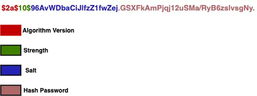

# final-assessment
## Table of Contents

- [final-assessment](#final-assessment)
  - [Table of Contents](#table-of-contents)
    - [API design and validation](#api-design-and-validation)
    - [Spring security password](#spring-security-password)
      - [How BCrypt Works](#how-bcrypt-works)


### API design and validation

Please refer to the power point slides in this repo

### Spring security password

[Online: Password encoding in spring security
](https://www.javadevjournal.com/spring/password-encoding-in-spring-security/#:~:text=Introduction,back%20to%20the%20plaintext%20form.)

Spring Security provides password encoding feature using the PasswordEncoder interface. It’s a one way transformation, means you can only encode the password, but there is no way to decode the password back to the plaintext form.

The standard use of this feature is to compare the user-provided password at the time of authentication (encoding the user password).

My SMP project is using the BCryptPasswordEncoder implementation for the password encoding in spring security.

```java
@Bean
public PasswordEncoder passwordEncoder() {
    return new BCryptPasswordEncoder();
}

@Autowired
public void configureGlobal(AuthenticationManagerBuilder authenticationManagerBuilder) throws Exception {
    authenticationManagerBuilder.userDetailsService(jwtService).passwordEncoder(passwordEncoder());
}

@Autowired
private PasswordEncoder passwordEncoder;
public String getEncodedPassword(String password) {
    return passwordEncoder.encode(password);
}
```

Spring Boot provides different password encoding implementation with the flexibility to choose a certain encoder based on our need. The BCryptPasswordEncoder implementation uses the bcrypt algorithm to hash the passwords (BCrypt strong hashing function)

1. BCryptPasswordEncoder as a bean in `WebSecurityConfiguration.java`
```java
@Bean
public PasswordEncoder passwordEncoder() {
    return new BCryptPasswordEncoder();
}
```
- The BCryptPasswordEncoder provides strength as a constructor argument to compute the hash. The larger value shows the longer time to hash but stronger password.
- We can also pass SecureRandom to randomize the generated hashes.
- This algorithm generate String of length 60 (example: `$2a$10$3aJNfNuXyY3V8uZRLP4sA.CxKtEBt6wBbT/eujZkhxhAqVYKaB9je`)
- acurrent BCryptPasswordEncoder bean is using the default configurations, we can use the updated/custom version of the password encoder if you don’t want to use default configurations

    ```java
    @Bean
    public PasswordEncoder passwordEncoder() {
        return new BCryptPasswordEncoder(20); // strength(iterations) 20: the log rounds (2^x) to use, between 4 and 31
    }
    ```
    The larger the strength parameter the more work will have to be done (exponentially) to hash the passwords. The default value is 10.
    
#### How BCrypt Works
- one important question about the BCrypt algorithm – “If salt is random when encoding is called, how can BCrypt check if password submitted by user matches with the store one?“. 
  - BCrypt generates the salt internally (we need not pass it).
  - It stores contacts with the cost and the cipher in a single field delimited by $.
  - When the user tries to login, it uses it on authentication
- Example:
  - $2a$10$96AvWDbaCiJlfzZ1fwZej.GSXFkAmPjqj12uSMa/RyB6zsIvsgNy.
    - 
    - The first part represents the version `$2a, $2b, $2y`, it is $2a$.
    - The second part is the strength – $10$ for our example.
    - The next 22 characters are the salt for the password (96AvWDbaCiJlfzZ1fwZej.).
    - Remaining section is the hashed password.
